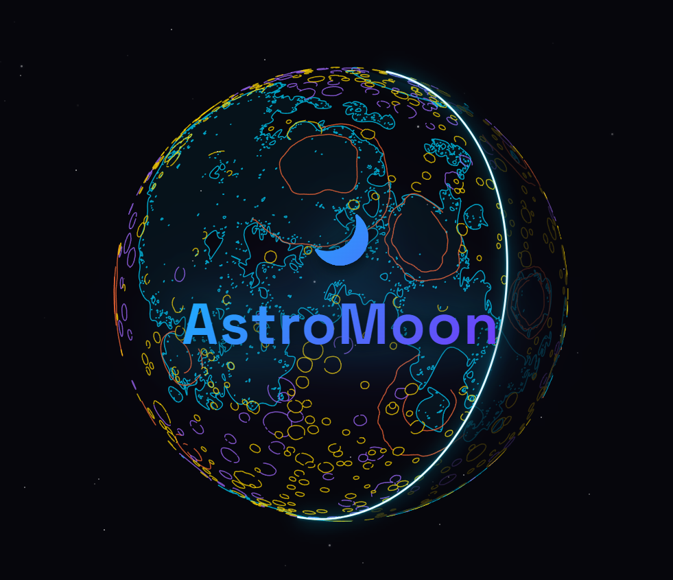

# 🌑 AstroMoon

**AstroMoon** est un outil d'analyse sélénographique conçu spécialement pour les astrophotographes. Il permet de superposer des calques vectoriels précis sur vos propres photographies de la Lune, afin d'identifier facilement les formations géologiques et de valider vos conditions de prise de vue.

  

## ✨ Fonctionnalités principales

- **Alignement Intelligent :** Superposition automatique des mers et des cratères majeurs selon la date et l'heure de votre cliché.
- **Synchronisation Temporelle :** Récupération automatique de la date via le nom du fichier image ou ses métadonnées (EXIF).
- **Adaptation au Matériel :** Bascule rapide de l'orientation du calque, que vous utilisiez un simple trépied photographique ou une monture équatoriale de suivi.
- **Visualisation de la Phase :** Affichage dynamique du terminateur (la ligne de séparation entre le jour et la nuit lunaire).

## 🧪 Tester l'application

Vous n'avez pas de photo de la Lune sous la main ? Des clichés de test sont disponibles dans le dossier `/assets` de ce projet.
*(Remerciements à **Maxime Goyard** pour ces photographies formidables).*

1. **Téléchargez** une image depuis le dossier `/assets`.
2. **Glissez-déposez** simplement le fichier directement dans la fenêtre d'**AstroMoon**.
3. **Synchronisation :** Le widget temporel détectera automatiquement la date et l'heure grâce au nom du fichier.
4. **Localisation :** Pour profiter de ces clichés de test dans des conditions optimales, réglez manuellement le lieu sur **Thionville** : cela permettra un alignement parfait de la grille et des calques sur l'image.

## 📚 Ressources et Sources

Le projet s'appuie sur des outils et des bases de données scientifiques de référence :

- **Préparation des données :** [QGIS](https://qgis.org/), le système d'information géographique open source.
- **Données Géologiques :** Cartographie officielle issue de l'[USGS (Unified Geologic Map of the Moon)](https://astrogeology.usgs.gov/search/map/unified_geologic_map_of_the_moon_1_5m_2020).
- **Moteur Astronomique :** Calculs de positionnement et de libration via la bibliothèque [Astronomy.js](https://github.com/cosinekitty/astronomy).

## 🚀 Feuille de route (Roadmap)

Le développement d'**AstroMoon** se poursuit. Voici les prochaines étapes prévues :

### ⚡ Performances & Rendu
- [x] **Nouveau moteur graphique :** Refonte complète pour assurer une fluidité parfaite et un affichage performant (via PixiJS).
- [ ] **Profils graphiques dynamiques :** Choix entre des modes allant de "Performance" (ordinateurs modestes) à "Qualité maximale" (Pixel Perfect).
- [ ] **Ajustement automatique :** L'application s'auto-configurera silencieusement pour correspondre à la puissance de votre navigateur.
- [ ] **Mode Studio :** Une fonction d'exportation d'images en très haute résolution, spécialement conçue pour les tirages photographiques et les publications.

### 🗺️ Évolution de la Cartographie
- [ ] **Relief et Topographie :** Superposition de cartes d'élévation pour visualiser les hauteurs et profondeurs.
- [ ] **Base de données complète :** Intégration de l'intégralité des cratères (face visible et face cachée de la lune).
- [ ] **Points d'Intérêt historiques :** Marques des sites d'atterrissage remarquables (missions Apollo, atterrisseurs, rovers...).

### ⚙️ Fonctionnalités Pratiques
- [ ] **Sauvegarde de session :** Possibilité d'enregistrer vos sessions de travail et vos réglages pour les reprendre plus tard.
- [ ] **Enrichissement des données :** Affichage d'informations détaillées au survol ou au clic sur les formations lunaires.

---

### 💬 Suggestions & Retours
Le projet est actuellement en phase bêta. Si vous avez des idées d'amélioration, des suggestions de fonctionnalités ou des retours d'expérience sur l'utilisation d'**AstroMoon**, n'hésitez pas à ouvrir une *issue* ou à m'en faire part !

---

*Bon ciel à tous !* 🔭